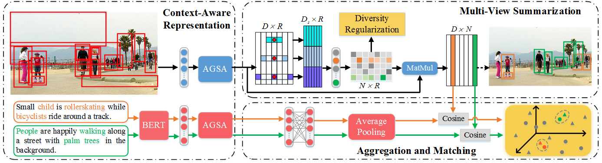

# Context-Aware Multi-View Summarization Network for Image-Text Matching(CAMERA)
PyTorch code of the paper "Context-Aware Multi-View Summarization Network for
Image-Text Matching". It is built on top of [VSRN](https://github.com/KunpengLi1994/VSRN) and [SAEM](https://github.com/yiling2018/saem). 

Leigang Qu, Meng Liu, Da Cao, Liqiang Nie, and Qi Tian. "Context-Aware Multi-View Summarization Network for Image-Text Matching", ACM MM, 2020.  [[pdf](https://doi.org/10.1145/3394171.3413961)]

## Introduction
Image-text matching is a vital yet challenging task in the field of multimedia analysis. Over the past decades, great efforts have been made to bridge the semantic gap between the visual and textual modalities. Despite the significance and value, most prior work is still confronted with a multi-view description challenge, i.e., how to align an image to multiple textual descriptions with semantic diversity. Toward this end, we present a novel context-aware multi-view summarization network to summarize context-enhanced visual region information from multiple views. To be more specific, we design an adaptive gating self-attention module to extract representations of visual regions and words. By controlling the internal information flow, we are able to adaptively capture context information. Afterwards, we introduce a summarization module with a diversity regularization to aggregate region-level features into image-level ones from different perspectives. Ultimately, we devise a multi-view matching scheme to match multi-view image features with corresponding text ones. To justify our work, we have conducted extensive experiments on two benchmark datasets, i.e., Flickr30K and MS-COCO, which demonstrates the superiority of our model as compared to several state-of-the-art baselines.



## Requirements 
We recommended the following dependencies.

* Python 2.7 
* [PyTorch](http://pytorch.org/) (0.4.1)
* [NumPy](http://www.numpy.org/) (>1.12.1)
* [TensorBoard](https://github.com/TeamHG-Memex/tensorboard_logger)
* [pycocotools](https://github.com/cocodataset/cocoapi)
* [torchvision]()
* [matplotlib]()


* Punkt Sentence Tokenizer:
```python
import nltk
nltk.download()
> d punkt
```

## Download data

Download the dataset files and pre-trained models. We use splits produced by [Andrej Karpathy](http://cs.stanford.edu/people/karpathy/deepimagesent/). The raw images can be downloaded from from their original sources [here](http://nlp.cs.illinois.edu/HockenmaierGroup/Framing_Image_Description/KCCA.html), [here](http://shannon.cs.illinois.edu/DenotationGraph/) and [here](http://mscoco.org/).

We follow [bottom-up attention model](https://github.com/peteanderson80/bottom-up-attention) and [SCAN](https://github.com/kuanghuei/SCAN) to obtain image features for fair comparison. More details about data pre-processing (optional) can be found [here](https://github.com/kuanghuei/SCAN/blob/master/README.md#data-pre-processing-optional). All the precomputed image features data needed for reproducing the experiments in the paper, can be downloaded from [SCAN](https://github.com/kuanghuei/SCAN) by using:

```bash
wget https://scanproject.blob.core.windows.net/scan-data/data.zip
```

You can also get the data from google drive: https://drive.google.com/drive/u/1/folders/1os1Kr7HeTbh8FajBNegW8rjJf6GIhFqC. 

Besides, we use [bottom-up attention](https://github.com/peteanderson80/bottom-up-attention) to extract the positions of detected boxes, including coordinate,  width and height,  which can be downloaded from https://drive.google.com/file/d/1K9LnWJc71dK6lF1BJMPlbkIu_vYmHjVP/view?usp=sharing

We refer to the path of extracted files as `$DATA_PATH`. 

## BERT model

We use the BERT code from [BERT-pytorch](https://github.com/huggingface/pytorch-transformers). Please following [here](https://github.com/huggingface/pytorch-transformers/blob/4fc9f9ef54e2ab250042c55b55a2e3c097858cb7/docs/source/converting_tensorflow_models.rst) to convert the Google BERT model to a PyTorch save file `$BERT_PATH`.

## Training new models
Run `train.py`:

For MSCOCO:

```bash
python train.py --data_path $DATA_PATH --bert_path $BERT_PATH --data_name coco_precomp --logger_name runs/coco --max_violation --num_epochs 40 --lr_update 20
```

For Flickr30K:

```bash
python train.py --data_path $DATA_PATH --bert_path $BERT_PATH --data_name f30k_precomp --logger_name runs/flickr --max_violation --num_epochs 30 --lr_update 10
```

## Evaluate trained models

Modify the model_path and data_path in the evaluation_models.py file. Then Run `evaluate_models.py`:

```bash
python evaluate_models.py
```

To do cross-validation on MSCOCO 1K test set, pass `fold5=True`. Pass `fold5=False` for evaluation on MSCOCO 5K test set. Pretrained models can be downloaded from https://drive.google.com/drive/folders/16O9cqYDnQdLKHyiOUTUexih_yCfzTelW?usp=sharing.

## Reference

```
@inproceedings{qu2020camera,
	title={Context-Aware Multi-View Summarization Network for Image-Text Matching},
	author={Qu, Leigang and Liu, Meng and Cao, Da and Nie, Liqiang and Tian, Qi},
	booktitle={Proceedings of the 28th ACM International Conference on Multimedia},
	pages={1-9},
	year={2020}
}
```

