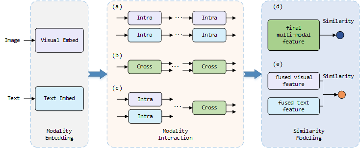

# Where Does the Performance Improvement Come From? \- A Reproducibility Concern about Image-Text Retrieval
PyTorch code of the paper "Where Does the Performance Improvement Come From? - A Reproducibility Concern about Image-Text Retrieval". It includes five models of [VSE++](https://github.com/fartashf/vsepp), [SCAN](https://github.com/kuanghuei/SCAN), [VSRN](https://github.com/KunpengLi1994/VSRN), [SAEM](https://github.com/yiling2018/saem), [SGRAF](https://github.com/Paranioar/SGRAF) and [CAMERA](https://github.com/LgQu/CAMERA).

Jun Rao, Fei Wang, Liang Ding, Shuhan. Qi, Yibin Zhan, Weifeng Liu, and Dacheng Tao, [“Where does the performance improvement come from - a reproducibility concern about image-text retrieval,”](https://arxiv.org/abs/2203.03853) in SIGIR, 2022.

# Contents
1. [Introduction](#introduction)
2. [Code](#code)

    * [Requirement](#requirement)
    * [Down data and vocab](#down-data-and-vocab)
    * [Pretrained BERT model](#pretrained-bert-model)
    * [Train](#train)
        
        * [VSE++](#vse)
        * [SCAN](#scan)
        * [VSRN](#vsrn)
        * [SAEM](#saem)
        * [SGRAF](#sgraf)
        * [CAMERA](#camera)
    * [Test](#test)
3. [Performance](#performance)
4. [Statement](#statement)
5. [Vision](#vision)
6. [License](#license)
7. [Citation](#citation)


# Introduction
This article aims to provide the information retrieval community with some reflections on recent advances in retrieval learning by analyzing the reproducibility of image-text retrieval models. Due to the increase of multimodal data over the last decade, image-text retrieval has steadily become a major research direction in the field of information retrieval. Numerous researchers train and evaluate image-text retrieval algorithms using benchmark datasets such as MS-COCO and Flickr30k. Research in the past has mostly focused on performance, with multiple state-of-the-art methodologies being suggested in a variety of ways. According to their assertions, these techniques provide improved modality interactions and hence more precise multimodal representations. In contrast to previous works, we focus on the reproducibility of the approaches and the examination of the elements that lead to improved performance by pretrained and nonpretrained models in retrieving images and text.

To be more specific, we first examine the related reproducibility concerns and explain why our focus is on image-text retrieval tasks. Second, we systematically summarize the current paradigm of image-text retrieval models and the stated contributions of those approaches. Third, we analyze various aspects of the reproduction of pretrained and nonpretrained retrieval models. To complete this, we conducted ablation experiments and obtained some influencing factors that affect retrieval recall more than the improvement claimed in the original paper. Finally, we present some reflections and challenges that the retrieval community should consider in the future. Our source code is publicly available at https://github.com/WangFei-2019/Image-text-Retrieval.


<center><b><font size='2'>Fig: A Unified Framework OF image-text retrieval</font></b></center></font>

# Code
We change all sub-project code to fit torch1.7 and CUDA11 and add random seed for all methods. You can use it from [code](https://github.com/WangFei-2019/Image-text-Retrieval).

## Requirement
We recommended the following dependencies.

* Python 3.7  
* [PyTorch](http://pytorch.org/) (1.7.1)
* [NumPy](http://www.numpy.org/) (1.19.5)
* [torchvision]()(0.8.2)
* [TensorBoard](https://github.com/TeamHG-Memex/tensorboard_logger)
* [pycocotools](https://github.com/cocodataset/cocoapi)

* Punkt Sentence Tokenizer:
```python
import nltk
nltk.download()
> d punkt
```
## Down data and vocab
We follow [bottom-up attention model](https://github.com/peteanderson80/bottom-up-attention) and [SCAN](https://github.com/kuanghuei/SCAN) to obtain image features for fair comparison. 
More details about data pre-processing (optional) can be found [here](https://github.com/kuanghuei/SCAN/blob/master/README.md#data-pre-processing-optional). 
All the data needed for reproducing the experiments in the paper, including image features and vocabularies, can be downloaded from [SCAN](https://github.com/kuanghuei/SCAN) by using:

```bash
wget https://scanproject.blob.core.windows.net/scan-data/data.zip
wget https://scanproject.blob.core.windows.net/scan-data/vocab.zip
# You can also get the data from google drive: https://drive.google.com/drive/u/1/folders/1os1Kr7HeTbh8FajBNegW8rjJf6GIhFqC.
```

We use [bottom-up attention](https://github.com/peteanderson80/bottom-up-attention) to extract the positions of detected boxes, including coordinate,  width and height,  which can be downloaded from https://drive.google.com/file/d/1K9LnWJc71dK6lF1BJMPlbkIu_vYmHjVP/view?usp=sharing. You can put MSCOCO/Flickr30K data in a same file.

We refer to the path of extracted files as `$DATA_PATH`. 

[An example](#datapath) for a `$DATA_PATH`.


## Pretrained BERT model
We use the BERT code from [BERT-pytorch](https://github.com/huggingface/pytorch-transformers). Please following [here](https://github.com/huggingface/pytorch-transformers/blob/4fc9f9ef54e2ab250042c55b55a2e3c097858cb7/docs/source/converting_tensorflow_models.rst) to convert the Google BERT model to a PyTorch save file `$BERT_PATH`.

## Train
You can see the details of all hyperparams in [config.py](./itr/config.py). 
If you want to know more detail about each method, look at the README of each method project in barch "original". 

```bash
# An example for training.
python train.py with "$METHOD_NAME" data_path="$DATA_PATH" data_name="$DATA_NAME"
```

### VSE++
```bash
python train.py with VSE_PP data_path="$DATA_PATH" data_name="$DATA_NAME" max_violation=True
```

### SCAN
#### t-i LSE 
```bash
# For MSCOCO
python train.py with SCAN data_path="$DATA_PATH" data_name=coco_precomp max_violation=True max_violation=True bi_gru=True agg_func=LogSumExp cross_attn=t2i lambda_lse=6 lambda_softmax=9
#For Flickr30K
python train.py with SCAN data_path="$DATA_PATH" data_name=f30k_precomp max_violation=True max_violation=True bi_gru=True agg_func=LogSumExp cross_attn=t2i lambda_lse=6 lambda_softmax=9
```
#### t-i AVG 
```bash
# For MSCOCO
python train.py with SCAN data_path="$DATA_PATH" data_name=coco_precomp max_violation=True max_violation=True bi_gru=True agg_func=Mean cross_attn=t2i lambda_lse=6 lambda_softmax=9
# For Flickr30K
python train.py with SCAN data_path="$DATA_PATH" data_name=f30k_precomp max_violation=True max_violation=True bi_gru=True agg_func=Mean cross_attn=t2i lambda_lse=6 lambda_softmax=9
```
#### i-t LSE 
```bash
# For MSCOCO
python train.py with SCAN data_path="$DATA_PATH" data_name=coco_precomp max_violation=True max_violation=True bi_gru=True agg_func=LogSumExp cross_attn=i2t lambda_lse=20 lambda_softmax=4
# For Flickr30K
python train.py with SCAN data_path="$DATA_PATH" data_name=coco_precomp max_violation=True max_violation=True bi_gru=True agg_func=LogSumExp cross_attn=i2t lambda_lse=5 lambda_softmax=4
```
#### i-t AVG 
```bash
# For MSCOCO
python train.py with SCAN data_path="$DATA_PATH" data_name=coco_precomp max_violation=True max_violation=True bi_gru=True agg_func=Mean cross_attn=i2t lambda_lse=6 lambda_softmax=4
# For Flickr30K
python train.py with SCAN data_path="$DATA_PATH" data_name=f30k_precomp max_violation=True max_violation=True bi_gru=True agg_func=Mean cross_attn=i2t lambda_lse=6 lambda_softmax=4
```

### VSRN
```bash
# For MSCOCO
python train.py with VSRN data_path="$DATA_PATH" data_name=coco_precomp max_violation=True lr_update=15
# For Flickr30K
python train.py with VSRN data_path="$DATA_PATH" data_name=f30k_precomp max_violation=True lr_update=10
```

### SAEM
```bash
python train.py with SAEM data_path="$DATA_PATH" data_name="$DATA_NAME" max_violation=True bert_path="$BERT_PATH"
```

### SGRAF
#### SGR
```bash
# For MSCOCO
python train.py with SGRAF data_path="$DATA_PATH" data_name=coco_precomp module_name=SGR max_violation=True num_epochs=20 lr_update=10
# For Flickr30K
python train.py with SGRAF data_path="$DATA_PATH" data_name=f30k_precomp module_name=SGR max_violation=True num_epochs=40 lr_update=30
```
#### SAF
```bash
# For MSCOCO
python train.py with SGRAF data_path="$DATA_PATH" data_name=coco_precomp module_name=SAF max_violation=True num_epochs=20 lr_update=10
# For Flickr30K
python train.py with SGRAF data_path="$DATA_PATH" data_name=f30k_precomp module_name=SAF max_violation=True num_epochs=30 lr_update=20
```

### CAMERA
```bash
# For MSCOCO
python train.py with CAMERA data_path="$DATA_PATH" data_name=coco_precomp bert_path="$BERT_PATH" max_violation=True num_epochs=40 lr_update=20
# For Flickr30K
python train.py with CAMERA data_path="$DATA_PATH" data_name=coco_precomp bert_path="$BERT_PATH" max_violation=True num_epochs=30 lr_update=10
```

## Test 
There is a complete test progress in [test.py](./test.py).
```python
from itr.metricmodule import evaluation

# Evaluate A Single Modal.
DATA_PATH = None  # If test data path is different from train data path, please give a new path to test.
MODEL_PATH = '$MODEL_PATH'
# ## Test on Flickr30k
evaluation.evalrank_single(model_path=MODEL_PATH, data_path=DATA_PATH, split='test')
# ## Test on MSCOCO (1000test→fold5=True; 5000test→fold5=False)
evaluation.evalrank_single(model_path=MODEL_PATH, data_path=DATA_PATH, split='testall', fold5=True)


# Evaluate The Ensemble Modal.
DATA_PATH = None  # If test data path is different from train data path, please give a new path to test.
MODEL_PATH_1 = '$MODEL_PATH'
MODEL_PATH_2 = '$MODEL_PATH'
# ## Test on Flickr30k
evaluation.evalrank_ensemble(model_path=MODEL_PATH_1, model_path2=MODEL_PATH_2, data_path=DATA_PATH, split='test')
## Test on MSCOCO (1000test→fold5=True; 5000test→fold5=False)
evaluation.evalrank_ensemble(model_path=MODEL_PATH_1, model_path2=MODEL_PATH_2, data_path=DATA_PATH, split='testall', fold5=False)
```

# Performance
The detailed data in the paper.
## The Result on F30K Test.
***
|                Method               |              |                |                |  Flickr30K |     Dataset    |                |                |
|:-----------------------------------:|:------------:|:--------------:|:--------------:|:--------------:|:--------------:|:--------------:|:--------------:|
|                                     |              |                |  Image-to-Text |                |                |  Text-to-Image |                |
|                                     |              |       R@1      |       R@5      |      R@10      |       R@1      |       R@5      |      R@10      |
|                VSE++                |              | 43.7/44.4/31.7 | 71.9/73.1/61.4 | 82.1/83.1/73.1 | 32.3/32.6/26.2 | 60.9/61.2/57.4 | 72.1/79.5/70.1 |
|                 SCAN                | t-i LSE | 61.1/58.9/45.4 | 85.4/85.5/78.9 | 91.5/91.5/87.7 |  43.3/41.3/35  | 71.9/69.8/65.1 | 80.9/79.4/76.4 |
|                                     | t-i AVG | 61.8/63.0/47.5 | 87.5/88.3/80.2 | 93.7/93.9/89.0 | 45.8/44.5/35.8 | 74.4/73.9/67.0 | 83.0/81.7/77.8 |
|                                     | i-t LSE | 67.7/66.3/46.5 |  88.9/88.4/77  |  94/93.7/86.2  | 44.0/42.0/33.9 | 74.2/72.2/64.0 | 82.6/81.1/74.8 |
|                                     | i-t AVG | 67.9/67.7/46.0 |  89/88.7/77.5  |  94.4/94.6/87  | 43.9/44.5/34.1 | 74.2/73.5/65.9 | 82.8/82.3/76.4 |
|                 VSRN                |              | 71.3/67.7/54.7 | 90.6/88.2/82.5 |  96/93.8/90.2  | 54.7/49.1/40.6 | 81.8/75.8/72.0 | 88.2/84.1/81.5 |
|                SGRAF                |      SAF     | 73.7/73.5/74.5 | 93.3/90.5/92.5 | 96.3/95.5/96.8 | 56.1/53.1/56.9 | 81.5/78.7/82.4 |  88/85.4/89.1  |
|                                     |      SGR     | 75.2/74.6/73.4 | 93.3/93.1/93.1 | 96.6/96.5/97.2 | 56.2/56.1/54.9 | 81.0/80.4/81.4 | 86.5/87.3/88.1 |
|  SAEM (random initialization Bert)  |              | 69.1/50.4/40.3 | 91.0/76.5/70.4 | 95.1/85.7/79.3 | 52.4/34.1/28.5 | 81.1/62.4/57.6 | 88.1/72.3/68.5 |
|        SAEM (pretrained Bert)       |              | 69.1/68.1/63.1 | 91.0/90.6/88.9 | 95.1/95.5/94.4 | 52.4/52.6/50.1 | 81.1/80.1/79.7 | 88.1/87.1/87.6 |
| CAMERA (random initialization Bert) |              | 78.0/38.8/50.1 | 95.1/61.6/79.2 | 97.9/71.6/87.8 | 60.3/23.7/35.5 | 85.9/47.9/65.7 | 91.7/56.9/76.4 |
|       CAMERA (pretrained Bert)      |              | 78.0/67.0/71.1 | 95.1/90.6/91.7 | 97.9/96.2/95.7 | 60.3/52.0/55.1 | 85.9/84.1/82.9 | 91.7/92.6/89.8 |

***
## Result on MSCOCO 1K Test.
***

|                Method               |              |                |                |   MSCOCO(1K)   |     Dataset    |                |                |
|:-----------------------------------:|:------------:|:--------------:|:--------------:|:--------------:|:--------------:|:--------------:|:--------------:|
|                                     |              |                |  Image-to-Text |                |                |  Text-to-Image |                |
|                                     |              |       R@1      |       R@5      |      R@10      |       R@1      |       R@5      |      R@10      |
|                VSE++                |              |  ’-/67.8/35.4  |  ‘-/90.9/65.2  |  ‘-/96.1/75.9  |  ‘-/56.9/25.2  |  ‘-/87.6/54.9  |  ‘-/93.2/67.4  |
|                 SCAN                | t-i LSE | 67.5/64.4/54.4 | 92.9/91.9/86.0 | 97.6/96.9/94.5 |  53/49.5/40.7  |  85.4/83/76.1  | 92.9/91.2/86.7 |
|                                     | t-i AVG | 70.9/69.4/57.1 | 94.5/93.8/88.6 | 97.8/97.5/95.8 | 56.4/54.9/45.4 |   87/85.8/79   | 93.9/93.2/88.5 |
|                                     | i-t LSE | 68.4/65.9/49.0 | 93.9/93.3/83.0 | 98.0/98.0/92.9 | 54.8/53.1/38.1 | 86.1/85.2/75.4 | 93.3/92.7/87.3 |
|                                     | i-t AVG | 69.2/68.1/55.9 | 93.2/93.7/88.8 | 97.5/97.5/95.7 | 54.4/55.5/44.5 |  86/86.3/79.6  | 93.6/93.5/89.5 |
|                 VSRN                |              | 76.2/71.1/66.7 | 94.8/94.1/92.4 | 98.2/97.6/96.8 | 62.8/58.5/55.4 | 89.7/87.2/86.4 | 95.1/93.5/92.9 |
|                SGRAF                |      SAF     | 76.1/75.9/75.5 | 95.4/95.5/95.3 | 98.3/98.3/98.1 | 61.8/60.5/60.7 | 89.4/88.5/89.0 | 95.3/94.7/95.1 |
|                                     |      SGR     |  78/76.6/74.9  | 95.8/95.8/95.5 | 98.2/98.4/98.2 | 61.4/61.0/60.3 | 89.3/89.2/89.0 | 95.4/95.1/94.9 |
|  SAEM (random initialization Bert)  |              | 71.2/58.9/56.3 | 94.1/87.2/83.8 | 97.7/93.6/91.5 | 57.8/47.5/41.3 | 88.6/81.2/76.4 | 94.9/90.5/87.7 |
|        SAEM (pretrained Bert)       |              | 71.2/73.9/70.2 | 94.1/93.9/92.7 | 97.7/97.7/97.0 | 57.8/59.9/58.1 | 88.6/89.8/88.2 | 94.9/95.4/94.9 |
| CAMERA (random initialization Bert) |              | 77.5/62.9/57.4 | 96.3/89.2/87.0 | 98.8/95.1/93.8 | 63.4/49.7/64.4 | 90.9/82.1/81.4 | 95.8/90.8/90.8 |
|       CAMERA (pretrained Bert)      |              | 77.5/75.4/72.1 | 96.3/95.3/94.3 | 98.8/98.6/98.3 | 63.4/62.0/59.7 | 90.9/90.1/89.4 | 95.8/95.0/95.0 |
***
## Result on MSCOCO 5K Test.
***
|                Method               |              |                |                |   MSCOCO(5K)   |          Dataset         |                |                |
|:-----------------------------------:|:------------:|:--------------:|:--------------:|:--------------:|:------------------------:|:--------------:|:--------------:|
|                                     |              |                |  Image-to-Text |                |                          |  Text-to-Image |                |
|                                     |              |       R@1      |       R@5      |      R@10      |            R@1           |       R@5      |      R@10      |
|                VSE++                |              |  49/44.8/21.3  | 79.8/75.2/45.9 | 88.4/84.6/59.1 |      37.1/32.6/16.5      | 72.2/66.7/42.4 | 83.8/79.1/56.7 |
|                 SCAN                | t-i LSE |   -/39.1/28.5  |    -/71/59.0   |   -/82.5/73.4  |        -/27.3/20.0       |   -/56.6/46.9  |   -/69.6/61.3  |
|                                     | t-i AVG |   -/45.1/30.4  |   -/75.7/62.5  |   -/86.4/76.5  |        -/32.9/23.9       |   -/62.2/51.7  |   -/74.4/65.1  |
|                                     | i-t LSE | 46.4/41.0/23.3 | 77.4/73.6/54.4 | 87.2/84.5/68.9 |      34.4/30.6/17.2      | 63.7/60.9/44.5 | 75.7/73.5/59.2 |
|                                     | i-t AVG |   -/43.4/30.4  |   -/75.0/62.7  |   -/86.6/76.6  |        -/32.9/22.0       |   -/62.8/51.7  |    -/75/65.7   |
|                 VSRN                |              |   53/48/41.3   | 81.1/77.6/73.4 | 89.4/87.3/84.4 |      40.5/35.9/31.8      | 70.6/66.4/63.4 | 81.1/77.7/75.7 |
|                SGRAF                |      SAF     | 53.3/54.8/51.9 |   -/82.4/81.6  | 90.1/90.4/89.8 |      39.8/38.8/38.7      |   -/67.7/68.1  |  80.2/79/79.3  |
|                                     |      SGR     | 56.9/55.1/51.3 |   -/82.7/81.2  | 90.5/90.7/89.5 | 40.2/39.1/3+D119:G1208.7 |   -/68.5/68.1  | 79.8/79.5/79.3 |
|  SAEM (random initialization Bert)  |              |   -/34.6/28.8  |   -/63.8/57.6  |   -/76.5/70.4  |        -/25.0/20.8       |   -/53.3/47.0  |   -/66.9/60.9  |
|        SAEM (pretrained Bert)       |              |   -/47.2/43.3  |   -/76.8/74.2  |   -/87.0/85.1  |        -/34.9/32.2       |   -/65.7/63.1  |   -/77.8/75.9  |
| CAMERA (random initialization Bert) |              | 55.1/38.3/32.0 | 82.9/68.1/32.4 |  91.2/80/75.2  |      40.5/27.5/24.4      | 71.7/57.3/53.4 | 82.5/69.9/66.8 |
|       CAMERA (pretrained Bert)      |              | 55.1/52.6/48.2 | 82.9/81.9/78.3 | 91.2/90.0/87.7 |      40.5/39.0/35.9      | 71.7/70.3/67.7 | 82.5/81.4/79.7 |
***
## Fine-tuned 10 Times with Different Random Seeds on Flickr30K Test.
***
| VSE++(seed) |      |               | Flickr30K | Dataset |               |      |
|:-----------:|:----:|:-------------:|:---------:|:-------:|:-------------:|:----:|
|             |      | Image-to-Text |           |         | Text-to-Image |      |
|             |  R@1 |      R@5      |    R@10   |   R@1   |      R@5      | R@10 |
|     1000    | 43.2 |      71.4     |    81.3   |   32.5  |       61      |  72  |
|     2000    | 45.1 |      74.3     |    83.2   |   32.7  |      61.8     | 72.3 |
|     3000    | 41.9 |      71.8     |    82.7   |   32.5  |      61.7     | 72.2 |
|     4000    | 45.2 |       73      |    83.3   |   32.9  |      61.6     | 72.5 |
|     5000    |  44  |      71.5     |     83    |   32.4  |      61.5     | 72.7 |
|     6000    | 43.2 |      73.3     |    83.3   |   32.9  |      61.2     | 72.3 |
|     7000    | 44.2 |      72.2     |    82.9   |    33   |      61.8     | 72.9 |
|     8000    |  47  |      72.8     |    82.5   |   32.6  |      61.6     | 72.6 |
|     9000    | 44.9 |      73.3     |    83.4   |   32.7  |      61.7     | 72.5 |
|    10000    | 45.3 |       73      |    82.7   |   32.8  |      61.3     | 72.7 |
***
***
| SCAN i-t AVG(seed) |      |               | Flickr30K | Dataset |               |      |
|:------------------:|:----:|:-------------:|:---------:|:-------:|:-------------:|:----:|
|                    |      | Image-to-Text |           |         | Text-to-Image |      |
|                    |  R@1 |      R@5      |    R@10   |   R@1   |      R@5      | R@10 |
|        1000        | 66.7 |      88.5     |    94.4   |    44   |      73.1     | 82.1 |
|        2000        | 65.8 |      88.4     |    93.9   |   44.5  |      72.9     | 82.3 |
|        3000        | 66.3 |      87.6     |    94.4   |   43.9  |      73.3     | 81.7 |
|        4000        | 66.3 |      87.6     |    93.7   |   43.1  |      72.6     | 81.2 |
|        5000        | 65.7 |      88.1     |    94.2   |   42.3  |      72.5     |  81  |
|        6000        | 66.5 |      87.8     |    93.8   |   43.7  |      72.5     | 81.8 |
|        7000        | 65.6 |      88.3     |    93.7   |   44.2  |      73.7     | 81.8 |
|        8000        | 66.8 |      88.6     |    93.9   |   44.7  |      73.2     | 82.2 |
|        9000        | 66.3 |      88.7     |    94.7   |   44.2  |      73.7     | 82.2 |
|        10000       | 66.2 |      89.1     |     94    |   44.7  |      73.2     | 82.3 |
***
***
| VSRN(seed) |      |               | Flickr30K | Dataset |               |      |
|:----------:|:----:|:-------------:|:---------:|:-------:|:-------------:|:----:|
|            |      | Image-to-Text |           |         | Text-to-Image |      |
|            |  R@1 |      R@5      |    R@10   |   R@1   |      R@5      | R@10 |
|    1000    | 65.3 |      87.7     |    92.8   |   48.7  |      76.3     | 84.1 |
|    2000    | 66.6 |      89.1     |    93.1   |    49   |      76.4     | 84.5 | 
|    3000    | 67.8 |      89.2     |    93.8   |    51   |      76.9     | 84.5 |
|    4000    | 66.9 |      87.7     |    93.5   |   50.2  |      76.4     | 84.9 |
|    5000    | 64.8 |      89.3     |    93.6   |   47.8  |      76.4     | 84.3 |
|    6000    | 66.5 |      88.5     |    93.2   |   49.8  |      76.2     | 84.1 |
|    7000    | 65.5 |      87.2     |    93.2   |   48.4  |      75.3     | 83.7 |
|    8000    | 70.7 |      90.8     |     95    |    52   |      78.5     | 85.6 |
|    9000    | 68.8 |      89.2     |    93.5   |   48.6  |      76.3     | 84.6 |
|    10000   | 65.7 |      88.8     |    94.4   |   48.7  |      75.9     | 84.5 |
***
***
| SAEM(seed) |      |               | Flickr30K | Dataset |               |      |
|:----------:|:----:|:-------------:|:---------:|:-------:|:-------------:|:----:|
|            |      | Image-to-Text |           |         | Text-to-Image |      |
|            |  R@1 |      R@5      |    R@10   |   R@1   |      R@5      | R@10 |
|    1000    | 69.5 |      91.9     |    95.1   |   53.2  |      80.9     | 88.3 |
|    2000    | 71.4 |      91.5     |    94.2   |   53.3  |      81.0     | 88.2 |
|    3000    | 69.3 |      90.1     |    94.6   |   52.5  |      80.2     | 88.1 |
|    4000    | 68.3 |      90.8     |    95.3   |   52.0  |      80.6     | 88.3 |
|    5000    | 69.9 |      90.7     |    95.5   |   52.3  |      81.0     | 88.5 |
|    6000    | 70.1 |      91.6     |    95.5   |   53.0  |      81.6     | 88.5 |
|    7000    | 71.3 |      90.8     |    95.7   |   52.2  |      80.9     | 88.2 |
|    8000    | 72.0 |      91.0     |    96.0   |   52.9  |      81.4     | 88.3 |
|    9000    | 69.2 |      91.6     |    95.3   |   52.8  |      80.7     | 87.8 |
|    10000   | 67.8 |      90.7     |    95.5   |   52.2  |      80.4     | 87.8 |
***
***
| SGRAF-SGR(seed) |      |               | Flickr30K | Dataset |               |      |
|:---------------:|:----:|:-------------:|:---------:|:-------:|:-------------:|:----:|
|                 |      | Image-to-Text |           |         | Text-to-Image |      |
|                 |  R@1 |      R@5      |    R@10   |   R@1   |      R@5      | R@10 |
|       1000      | 75.6 |      92.4     |    96.3   |   56.6  |      81.3     | 87.3 |
|       2000      | 78.4 |      93.9     |    96.6   |   57.6  |      81.2     | 86.3 |
|       3000      | 76.4 |      93.9     |    96.4   |   55.9  |      81.5     | 87.4 |
|       4000      | 75.9 |      93.3     |    96.5   |   56.2  |      80.6     | 85.6 |
|       5000      | 74.8 |      93.2     |    97.1   |   56.2  |      81.5     | 86.8 |
|       6000      | 78.4 |      93.9     |    96.6   |   57.6  |      81.2     | 86.3 |
|       7000      | 75.4 |      93.1     |    96.2   |   56.4  |      81.8     | 87.1 |
|       8000      |  75  |      91.5     |    96.4   |   56.1  |      81.9     | 87.8 |
|       9000      | 76.5 |      93.2     |    96.4   |   55.9  |      81.6     | 87.5 |
|      10000      | 73.5 |      90.5     |    95.5   |   53.1  |      78.7     | 85.4 |
***
***
| CMERA(seed) |      |               | Flickr30K | Dataset |               |      |
|:-----------:|:----:|:-------------:|:---------:|:-------:|:-------------:|:----:|
|             |      | Image-to-Text |           |         | Text-to-Image |      |
|             |  R@1 |      R@5      |    R@10   |   R@1   |      R@5      | R@10 |
|     1000    | 77.2 |      93.3     |    97.0   |   59.0  |      84.5     | 90.7 |
|     2000    | 76.9 |      93.9     |    97.2   |   58.8  |      85.1     | 90.9 |
|     3000    | 77.6 |      94.3     |    96.8   |   58.8  |      85.0     | 90.8 |
|     4000    | 76.3 |      92.9     |    96.7   |   58.6  |      84.7     | 90.3 |
|     5000    | 76.8 |      95.1     |    98.0   |   59.3  |      84.7     | 90.7 |
|     6000    | 74.7 |      94.8     |    97.2   |   58.1  |      84.4     | 90.5 |
|     7000    | 76.3 |      94.4     |    96.9   |   58.7  |      84.9     | 90.5 |
|     8000    | 76.2 |      94.1     |    97.2   |   58.4  |      84.7     | 90.7 |
|     9000    | 75.3 |      93.9     |    96.8   |   59.0  |      84.9     | 90.6 |
|    10000    | 76.8 |      94.0     |    97.2   |   58.8  |      84.5     | 90.7 |
***
***
|           SAEM(seed)            |      |               | Flickr30K | Dataste |               |      |
|:-------------------------------:|:----:|:-------------:|:---------:|:-------:|:-------------:|:----:|
| with random initialization Bert |      | Image-to-Text |           |         | Text-to-Image |      |
|                                 |  R@1 |      R@5      |    R@10   |   R@1   |      R@5      | R@10 |
|               1000              | 50.6 |      77.3     |    86.3   |   34.3  |       63      | 72.6 |
|               2000              | 51.2 |      78.8     |    86.6   |   34.2  |      62.6     | 73.1 |
|               3000              | 50.1 |      76.2     |    84.2   |   34.9  |      62.6     |  72  |
|               4000              | 50.6 |      78.5     |    85.8   |   34.1  |      62.1     | 72.9 |
|               5000              | 50.7 |      77.2     |    86.2   |   33.1  |      62.3     | 72.5 |
|               6000              | 49.8 |      79.6     |    86.3   |   33.9  |       62      | 72.5 |
|               7000              | 50.6 |      79.3     |    86.5   |   33.7  |       63      | 72.7 |
|               8000              | 51.2 |      78.4     |    86.5   |   33.9  |      62.4     | 72.4 |
|               9000              | 50.4 |      77.4     |    86.4   |   33.4  |       62      | 72.6 |
|              10000              | 51.5 |      78.9     |    85.6   |   33.9  |      62.7     | 72.3 |
***
***
|           CMERA(seed)           |      |               | Flickr30K | Dataste |               |      |
|:-------------------------------:|:----:|:-------------:|:---------:|:-------:|:-------------:|:----:|
| with random initialization Bert |      | Image-To-Text |           |         | Text-to-Image |      |
|                                 |  R@1 |      R@5      |    R@10   |   R@1   |      R@5      | R@10 |
|               1000              | 51.8 |      76.7     |    83.6   |   33.7  |      61.2     | 70.3 |
|               2000              | 49.8 |      76.1     |    84.5   |   33.7  |      60.5     | 70.3 |
|               3000              |  40  |      66.4     |    77.2   |   26.3  |      50.6     | 59.9 |
|               4000              | 30.3 |      54.9     |    65.9   |   19.9  |      41.1     | 51.1 |
|               5000              | 46.3 |      72.8     |    80.1   |   29.1  |      55.2     | 64.3 |
|               6000              | 51.4 |      78.2     |    84.8   |   34.4  |       61      |  70  |
|               7000              | 49.8 |      75.4     |    82.8   |   33.1  |      58.9     | 67.4 |
|               8000              | 46.4 |      70.6     |    79.5   |   28.3  |      53.3     | 62.5 |
|               9000              | 44.1 |       70      |     79    |   28.3  |      54.3     | 63.6 |
|              10000              | 39.9 |      66.3     |    75.2   |   25.2  |      49.1     | 59.3 |
***

# Statement
In the research, we found that the image-text retrieval community need a unified project for a funture research. We publish a beta vision for Image-Test retrieval research. Every researcher is welcome to test the code, we will accept your valuable comments and reply in the issue area.

# Vision
beta-v0.1

# License
The license is CC-BY-NC 4.0.

# Citation

### Please cite as:

```bibtex
@inproceedings{rao2022reproducibility,
    title = {Where Does the Performance Improvement Come From - A Reproducibility Concern about Image-Text Retrieval},
    author = {Jun Rao and Fei Wang and Liang Ding and Shuhan Qi and Yibing Zhan and Weifeng Liu and Dacheng Tao},
    booktitle = {SIGIR},
    year = {2022}
}
```

#### DATA_PATH
```
+-- $DATA_PATH
    +-- coco_precomp
        |-- dev_boxes.npy
        |-- dev_caps.txt
        |-- dev_ids.txt
        |-- dev_img_sizes.npy
        |-- dev_ims.npy
        |-- testall_boxes.npy
        |-- testall_caps.txt
        |-- testall_ids.txt
        |-- testall_img_sizes.npy
        |-- testall_ims.npy
        |-- test_boxes.npy
        |-- test_caps.txt
        |-- test_ids.txt
        |-- test_img_sizes.npy
        |-- test_ims.npy
        |-- train_boxes.npy
        |-- train_caps.txt
        |-- train_ids.txt
        |-- train_img_sizes.npy
        |-- train_ims.npy
    +-- f30k_precomp
        |-- dev_boxes.npy
        |-- dev_caps.txt
        |-- dev_ids.txt
        |-- dev_img_sizes.npy
        |-- dev_ims.npy
        |-- dev_tags.txt
        |-- test_boxes.npy
        |-- test_caps.txt
        |-- test_ids.txt
        |-- test_img_sizes.npy
        |-- test_ims.npy
        |-- test_tags.txt
        |-- train_boxes.npy
        |-- train_caps.txt
        |-- train_ids.txt
        |-- train_img_sizes.npy
        |-- train_ims.npy
        |-- train_tags.txt
    +-- coco
    +-- f30k
    +-- 10crop_precomp
```